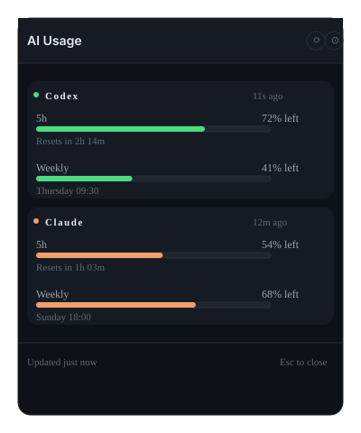

# AI Usage Widget

A Windows 11 system tray utility for monitoring OpenAI Codex and Anthropic Claude Code subscription quota consumption. Displays real-time usage percentages, reset countdowns, and integration status—all accessible via an elegant floating popup.

<div align="center">

[](#) 
[](#) 
[](#) 
[](#) 
[](#)

[Getting Started](#getting-started) • [Build Guide](#building) • [Architecture](plan.md) • [Privacy](#privacy--security)

</div>

---

## Preview

Click the system tray icon to reveal a compact floating widget:



## Features

- **Quota Monitoring** — Real-time consumption percentages for both 5-hour and weekly allocation windows
- **Reset Countdowns** — Human-readable countdown timers for when quotas reset
- **Dual Provider Support** — Integrated monitoring for both Codex (OpenAI) and Claude Code (Anthropic)
- **Native System Tray** — Minimalist floating popup, no taskbar window, no background process
- **Automatic Detection** — Detects installed Codex and Claude Code installations without configuration
- **Secure Integration** — No credentials stored, no authentication files accessed, local-only operation
- **Multi-Monitor Support** — Intelligent positioning across multiple displays with DPI awareness
- **Smart Refresh** — Real-time updates when available, fallback polling with bounded backoff
- **Settings Management** — Configure autostart behavior and provider integrations
- **Diagnostics** — Built-in diagnostics for troubleshooting provider connectivity

## Getting Started

### System Requirements

| Requirement | Version |
|---|---|
| **OS** | Windows 11 (x64) |
| **Node.js** | ≥ 20 LTS |
| **npm** | ≥ 9 |
| **Rust** | ≥ 1.77 (for building; optional for development) |
| **WebView2** | Automatically installed by the installer |

### Optional: Provider Installation

- **Codex CLI** — Detected automatically if installed; widget displays "Not installed" if absent
- **Claude Code** — Detected automatically if installed; widget displays "Not installed" if absent

Neither provider is required; the widget gracefully handles missing or unauthenticated installations.

### Development Setup

```bash
# Clone repository
git clone https://github.com/AsoStrife/Codex-Code-Widget.git
cd Codex-Code-Widget

# Install dependencies
npm install

# Start development server (browser with hot reload)
npm run dev

# Or launch as Tauri app (requires Rust)
npm start
```

### Build Commands

| Command | Output | Purpose |
|---|---|---|
| `npm run build` | Web bundle | Frontend only (no desktop wrapper) |
| `npm run build:portable` | `.exe` | Standalone executable |
| `npm run build:nsis` | `.exe` installer | Windows Setup installer |
| `npm run build:msi` | `.msi` | Windows Installer format |
| `npm run build:exe` | All formats | Full release build |

**Build output:** `./builds/`

```bash
npm run icons          # Generate tray icons from source
npm run typecheck      # Type-check all code
npm test               # Run frontend unit tests
npm run test:rust      # Run backend tests
npm run test:all       # Run all tests
npm run clean          # Clean build artifacts
```

## How Provider Integration Works

### Codex (OpenAI)

The widget spawns and maintains a `codex app-server` child process, communicating via JSON-RPC over stdio:

1. Widget spawns: `codex app-server`
2. Sends: `{ "method": "initialize" }`
3. Receives initialization response and capabilities
4. Calls: `{ "method": "account/rateLimits/read" }`
5. Listens for: `account/rateLimits/updated` notifications

**Implementation Details:**
- Quota windows are matched by duration (`windowDurationMins`): 300 = 5-hour, 10080 = weekly
- Automatic process restart with bounded backoff on unexpected exit
- Job object ensures clean termination even on crash or forced kill
- No direct access to Codex `auth.json` file—all communication through App Server protocol

### Claude Code (Anthropic)

Claude Code forwards rate-limit data to the configured status-line command. The widget integrates by installing itself as that command:

```
"C:\...\ai-usage-widget.exe" --claude-statusline-bridge
```

**Bridge Mode Operation:**
- Executable reads a single JSON payload from stdin
- Extracts only quota numbers (percentages and reset timestamps)
- Writes atomic snapshot to `%LOCALAPPDATA%\ai-usage-widget\claude-usage.json`
- Tauri WebView is never started in bridge mode
- Main widget process watches the cache file for updates (~300ms refresh)

**Status-Line Preservation:**
- Any existing status-line command is saved before installation
- Bridge mode executes the previous command on each update and mirrors its output
- Disabling Claude integration automatically restores the prior configuration

**First Run:** Claude displays "Waiting for Claude usage data" until Claude Code is used at least once.

## Architecture

### Technology Stack

| Layer | Technology | Purpose |
|---|---|---|
| **Desktop Shell** | Tauri 2 + Rust | System tray, window management, provider lifecycle |
| **Frontend** | Vue 3 + TypeScript | UI components and layouts |
| **State Management** | Pinia 3 | Reactive application state |
| **Styling** | Tailwind CSS 4 | Utility-first CSS framework |
| **Build Tool** | Vite 7 | Lightning-fast module bundler |
| **Testing** | Vitest + Cargo | JavaScript and Rust test suites |
| **Quality** | vue-tsc + Clippy | Type safety and linting |

### Project Structure

```
Codex-Code-Widget/
├── src/                        # Frontend (Vue 3 + TypeScript)
│   ├── App.vue                 # Root component
│   ├── main.ts                 # Entry point
│   ├── style.css               # Global theme and Tailwind config
│   ├── components/             # Reusable Vue components
│   ├── stores/                 # Pinia state stores
│   ├── types/                  # TypeScript domain models
│   └── lib/                    # Utilities (formatting, Tauri IPC)
│
├── src-tauri/                  # Backend (Rust + Tauri)
│   ├── src/
│   │   ├── main.rs             # Tauri main entry
│   │   ├── tray.rs             # System tray icon and menu
│   │   ├── window.rs           # Popup window management
│   │   ├── state.rs            # Shared mutable state
│   │   ├── commands.rs         # IPC command handlers
│   │   ├── providers/          # Normalized provider interface
│   │   │   ├── codex.rs        # Codex provider implementation
│   │   │   └── claude.rs       # Claude provider implementation
│   │   ├── codex/              # Codex-specific modules
│   │   │   ├── process.rs      # App Server subprocess
│   │   │   ├── rpc.rs          # JSON-RPC protocol
│   │   │   └── protocol.rs     # Message definitions
│   │   ├── claude/             # Claude-specific modules
│   │   │   ├── bridge.rs       # Status-line bridge mode
│   │   │   ├── config.rs       # Configuration management
│   │   │   └── cache.rs        # File watcher
│   │   └── platform/           # Platform-specific code
│   │       └── windows.rs      # Windows helper functions
│   └── Cargo.toml
│
├── scripts/
│   ├── generate-icons.mjs      # Icon generation from source SVG
│   └── build-release.mjs       # Release build orchestration
│
├── vite.config.ts              # Vite bundler configuration
├── tsconfig.json               # TypeScript compiler options
├── package.json                # Node dependencies
├── plan.md                      # Detailed implementation specification
└── README.md                    # This file
```

**Architectural Principle:** Provider-specific concepts (JSON-RPC, status-line payloads, window classifications) remain encapsulated in the Rust backend. The Vue layer works exclusively with a normalized `ProviderQuota` model, ensuring UI independence from provider implementation details.

## Usage & Behavior

### Interaction Model

- **Left-click tray icon** → Toggle popup visibility above icon
- **Right-click tray icon** → Context menu (Refresh, Settings, Quit)
- **Drag title bar** → Reposition widget (position persists)
- **Press Esc** → Close popup (or close settings panel if open)
- **Press Ctrl+R** → Manual refresh

### Window Properties

- **Dimensions:** Approximately 380×330–420 pixels (height adapts to content)
- **Positioning:** Appears above tray icon with intelligent fallback positioning on multi-monitor setups; respects DPI scaling (100%–200%)
- **Behavior:** Automatically hides on focus loss; does not appear in taskbar; remains on top while visible
- **Lifecycle:** Closing the popup does not terminate the application (use tray menu → Quit)

### Data Presentation

- **Missing Windows:** Displayed as "Not reported" rather than empty or full bars
- **Percentages:** Always shown as "remaining" (calculated as `100 − used`)
- **Provider Status:** Clearly labeled if provider is not installed or not authenticated
- **Waiting States:** Explicit status labels during initial data fetch

### Why No Token Counts

Codex and Claude subscription quotas are not fixed token buckets. Token consumption varies by model and workload characteristics. Both providers expose only percentage-used and reset timestamp information. Converting these percentages to "tokens remaining" would constitute speculation presented as fact—the widget displays only authoritative data.

## Privacy & Security

### Data Handling Guarantees

- ✅ **No external network calls** — All communication is local
- ✅ **No telemetry or analytics** — Zero tracking
- ✅ **No credential storage** — No API keys, tokens, or passwords persisted
- ✅ **No direct file access** — Does not read Codex `auth.json` or Anthropic credential files
- ✅ **No OAuth extraction** — Does not read or store OAuth tokens
- ✅ **No conversation content** — Does not persist chat history or API payloads
- ✅ **Atomic filesystem operations** — Cache writes use temp-file-then-rename pattern

### Storage & Cache Details

**Codex Provider:**
- All communication flows through the JSON-RPC protocol
- Zero filesystem access to authentication or sensitive data

**Claude Provider Cache:**
The local cache contains only quota metadata:
```json
{
  "fiveHour": {
    "usedPercentage": 23.5,
    "resetsAt": 1789502751
  },
  "weekly": {
    "usedPercentage": 41.2,
    "resetsAt": 1789808435
  },
  "updatedAt": 1789486202
}
```

**Local Storage Location:**
- Directory: `%LOCALAPPDATA%\ai-usage-widget\`
- Files: `settings.json`, `claude-usage.json`
- Diagnostics redact filesystem paths in user-facing output

## Troubleshooting

### Widget does not appear in system tray

```bash
npm run clean
npm run icons
npm run build:exe
```

### Codex quota not updating

- Verify Codex CLI availability: `codex app-server --help`
- Check widget diagnostics (Settings → Diagnostics)
- Rebuild: `npm run build:exe`

### Claude quota not working

- Verify Claude Code is authenticated
- Enable Claude integration in widget settings
- Use Claude Code at least once to trigger initial data fetch
- Review diagnostics output

### High CPU usage

```bash
npm run clean
npm run build:exe
```

## Testing

```bash
# Frontend unit tests (run once)
npm test

# Frontend tests (watch mode)
npm run test:watch

# Backend tests (Rust)
npm run test:rust

# All tests
npm run test:all
```

### Platform Acceptance Testing

Manual testing on Windows 11 with:
- DPI scaling: 100%, 125%, 150%, 200%
- Multi-monitor configurations
- Taskbar position variations
- Provider installed/missing scenarios
- Provider authenticated/unauthenticated states
- Window focus loss handling
- Tray icon interaction patterns

## License

MIT License — see [LICENSE](LICENSE) file for details.

## Contributing

Found a bug? [Open an issue](https://github.com/AsoStrife/Codex-Code-Widget/issues)

Pull requests welcome. To set up a development environment:

```bash
git clone https://github.com/AsoStrife/Codex-Code-Widget.git
cd Codex-Code-Widget
npm install
npm start
```

---

See [plan.md](plan.md) for the detailed technical specification and implementation roadmap.
